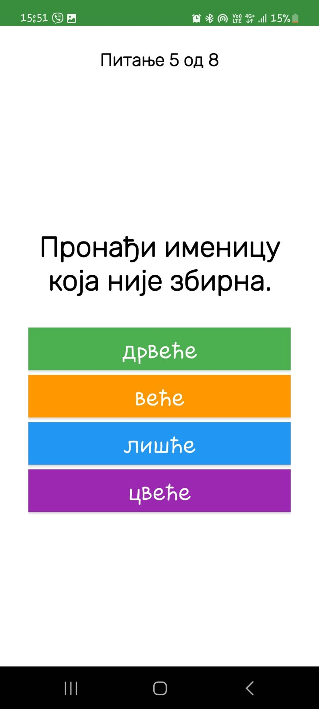

# Апликација за учење српског језика за ниже разреде основне школе

Ова апликација служи каопомоћно средство за учење српског језика. Циљна група су деца нижих разреда основне школе (први, други, трећи и четврти разред). Циљ је омогућити им квалитетне материјале који ће им на занимљив и интерактиван начин олакшати учење српског језика.

# Покретање

Апликација се тренутно тестира локално.
Да би се апликација исправно покренула за локално тестирање потребно је извршити
следеће:

1. Направите копију **.env.example** и преименујте је у **.env**.
2. Испуните вредности у **.env** fajlu na основу ваших подешавања.
3. Додати податке из json фајлова из фолдера Database у MongoDB колекцију и у .env фајлу у BASE_NAME уписати име колекције и у истом фајлу проверити да ли су PORT и HOST одговарајући
4. Променити IP адресу у серверском делу – Ово се ради у .env фајлу у ком је
дефинисана под назив BACKEND_URL.
5. Променити IP адресу у клијентском делу – Ово се ради у Singleton класи
Constants, где је дефинисана под називом SERVER_IP_ADRESS.
6. Покренути сервер преко терминала – Ово се ради тако што се позиционира у
серверски директоријум и покрене команда npm run start.
7. Покренути апликацију са клијентске стране. Тестирати апликацију на жељеном уређају (Wireless debugging или USB debugging) или је покренути у емулатору 

Када се изврше сви ови кораци сервер је спреман да комуницира са клијентским делом
односно прима и обрађује захтеве. Да је сервер повезан са базом може да се види у терминалу
преко поруке која се прикаже, јер када се покрене команда npm run start сервер се аутоматски
повеже на базу.
Прве две команде су веома важне да би сервер могао да комуницира са клијентским
делом. Због свега тога битно је пронаћи локалну IP адресу рачунара на коме се налази сервер
и јако је важно да се сервер и уређај на ком се тестира повезани на исти интернет.
Локална IP адреса сервера се проналази куцањем команде ipconfig у command prompt
конзоли. Та адреса се проналази у резултату те команде у делу Wireless LAN adapter Wi-Fi под
називом IPv4 Address.
У случају да серверска страна изгуби конекцију са Mongo DB, могуће је ручно
покренути Mongo DB тако што се пронађе у сервисима (services) и након притиска на десно
дугме миша, изабере опција за покретање (start).

# Функционалности апликације
У овом поглављу биће детаљно описано шта све апликација пружа из перспективе
корисника. Свака од функционалности која је доступна пријављеним корисницима биће
детаљно описана уз визуелне примере, како би се на што вернији начин приказале све
могућности које апликација нуди.
## Пријава у систем и регистрација новог корисника
На почетном екрану апликације налази се екран за пријављивање у систем, са ког се
притиском на опцију за регистрацију прелази на екран за регистрацију уколико је то потребно.
Приликом регистрације потребно је унети и-мејл адресу која до сада није коришћена за
прављење налога на овој апликацији и изабрати лозинку која задовољава одговарајућа
ограничења. Потребно је да има најмање 8 карактера, најмање једно велико слово и најмање
један број. Такође, да би се смањила могућност случајне грешке приликом уноса лозинке
постоји поље за потврду лозинке, али и опција да се прикаже и сакрије текст лозинке. Ако су
сви подаци исправно унети, кориснику се шаље верификациони линк на и-мејл адресу коју је
унео. Одабиром тог линка, корисник се аутоматски пребацује у апликацију као пријављен
корисник. Ако неки подаци нису исправни, приказује се грешка. Екрани за пријављивање у
систем и регистровање новог корисника су приказани на сликама испод.

    
    

Приликом пријављивања потребно је унети исправну и-мејл адресу и лозинку након
чега се постаје пријављен корисник у случају да су креденцијали исправни. У супротном се
приказује порука о грешци.
Постоји и могућност промене лозинке, притиском на текст под називом Заборављена
лозинка. Тада се кориснику, у случају да је унео валидну и-мејл адресу која постоји у бази, на
и-мејл адресу шаље образац за промену лозинке при чему се поново прате сва ограничења која
се прате и приликом регистрације и приказује порука о грешци у случају да неко ограничење
није задовољено или је лозинка иста као постојећа.

## Могућност коришћења апликације од стране више деце
Узевши у обзир то да нема свако дете телефон, ова апликација омогућава да је више
деце користи са истог налога при чему се за свако дете појединачно прати напредак. Међутим,
због чињенице да би већи број деце на једном налогу оптеретио базу, постоји ограничење да
са једног налога апликацији може да приступа максимално четворо деце. Свако дете бира свој
надимак и своју икону за свој профил (енгл. avatar, у даљем тексту: аватар).
## Екран за избор детета
Након што се корисник улогује, упућује се на екран за избор детета. На том екрану
излистана су сва деца тако што им је приказан аватар и надимак. Избор детета се врши
притиском на један од тих аватара или надимака. Постоји у дугме за додавање још једног
дечијег налога које је приказано само у случају када постоји мање од четворо деце на
коришћеном налогу. Притиском на то дугме, прелази се на екран за додавање детета.
## Екран за додавање детета
На овом екрану, за почетак се бира надимак детета. Потребно је само да не буде исти
као већ постојећи надимак на том налогу. Након што се успешно изабере име, приказује се
екран са аватарима и бира се један од аватара. Када се потврди избор аватара, апликација се
аутоматски поново преусмерава на екран за избор детета при чему се на том екрану тада налазе
и подаци додатог детета. Након што се изабере дете, прелази се на главни екран апликације.
На сликама испод редом су приказани екран за избор детета пре додавања детета, затим изглед екрана након притиска на дугме за додавање детета и избора надимка, затим изглед екрана приликом избора аватара док је на последњој слици приказан екран након изабраног аватара.

    
    
    
    

## Главни екран апликације
Главни екран апликације састоји се из три фрагмента. То су фрагмент за избор детета,
фрагмент са лекцијама и фрагмент са подешавањима. Сваки од ових фрагмената има иконицу
која му одговара и назив који га описује.
## Фрагмент за избор разреда
Фрагмент за избор разреда се састоји од 4 квадратно распоређених слика од којих свака
слика представља један разред. Изабирањем неке од слика, дете је изабрало из ког разреда
жели да се прикажу лекције и у сваком тренутку тај избор може лако да промени. Избором
разреда аутоматски се пребацује на централни фрагмент апликације где су приказане теме са
лекцијама. 

    
    

## Фрагмент са темама
Овај фрагмет апликације је јако важан јер су у њему приказане све области које
одговарају том разреду. У случају да дете није још увек изабрало разред, овом фрагменту не
може да се приступи. Сваки разред подељен је на неколико важних тема а свака тема подељена
је на лекције које су представљене иконицама и насловом и кроз фрагмент се пролази
вертикалним скроловањем при чему се тада смењују теме различитих типова. Постоји три
различита типа. То су: књижевност, граматика и правопис. Свака тема се састоји од неколико
лекција које јој по типу одговарају, али и једне игре вешалица и једног теста. Постоји и
разлика у изгледу различитих типова тема. Разлика је у начину на који је обојена позадина
текста са насловом теме, у изгледу иконица које јој одговарају, али и у самој позадини која им
одговара. Примери за сваки од три типа тема приказани су на сликама испод.
Притиском на сваку од иконица, улази се у лекцију која јој одговара. Оно што је такође важно
напоменути јесте то да свака од иконица визуелно мења када се успешно заврши лекција. Више
речи о томе ће бити у тексту који следи.

    
    
    

## Фрагмент са подешавањима
У овом фрагмету је могуће изабрати да друго дете користи апликацију и одјавити се из
апликације. Приликом избора другог детета, корисник се пребацује на исти екран као и када
након пријављивања бира дете и такође има и опцију да дода још деце у случају да није
прекорачен максималан број. Приликом одјављивања корисник више нема приступ
функционалностима које види пријављен корисник и упућује се на екран за пријаву у систем.

    

## Лекције
Лекције су један од најважнијих делова апликације. Оне су осмишљене тако да буду
корисне, занимљиве и визуелно приступачне деци. Садрже бројне слике, табеле, уграђене
видео снимке, али и различитости у боји текста и позадини текста у зависности од типа
садржаја. За текст је коришћен крупан фонт чији је стил пријатан и читљив за децу. Лекције
везане за граматику и правопис су кратке лекције са објашњеним граматичким концептима и
правописним правилима, док лекције везане за књижевност имају нешто другачији формат.
Већина њих обрађује неко дело и такве лекције у наслову садрже назив дела и име и презиме
аутора. На почетку тих лекија обавезно се налази и само дело. У већини лекција након дела
следи и видео снимак на ком је испричано или изрецитовано то дело. Затим испод видео
снимка, по потребни се описују неки нови појмови научени у лекцији а испод тога се приказују
непознате речи из лекције са њиховим значењем ако их има. На дну сваке од лекција налази
се дугме које води ка питањима. Апликација тренутно садржи 194 лекције. На сликама 4.9.1,
које следе приказани су делови из неких од лекција.

    
    
    
    

## Питања
После сваке лекције следе питања везана за њу. Постоји 5 типова питања:
1. Тачно/нетачно – потребно је изабрати да ли је нека тврдња тачна.
2. Вишеструки избор – деца добијају питање са неколико понуђених одговора и
потребно је да изаберу један од њих.
3. Класично питање са одговором – ово су недвосмислена питања на која деца треба
да напишу тачан одговор.
4. Исправак правописа – деца добијају поље са исписаним текстом који може да се
уреди и њихов задатак је да исправе правописне грешке.
5. Спојнице – деца добијају неколико појмова са леве стране и исти број појмова са
десне и имају задатак да сваки појам са леве стране повежу са одговарајућим
појмом са десне стране. 

    
    
    
    
    

Питања су организована тако да се увек приказују у насумичном редоследу. Ако дете
тачно одговори на питање, тада му се приказује једна насумично изабрана похвална порука из
низа од 15 порука и тада има могућност да пређе на следеће питање. У случају да одговор на
питање није тачан, приказује се насумично одабрана охрабрујућа порука и тачан одговор.
Након тога се прелази на следеће питање, али питање на које је дат нетачан одговор се
пребацује на крај низа са питањима и питања на која дете није одговорило тачно приказују се
онолико пута колико је потребно односно све док дете не да тачан одговор на њих. Дете је
успешно завршило лекцију када одговори на сва питања. Тачан и нетачан одговор су праћени
одговарајућим звуком.

    
    

Када се успешно заврши лекција, односно када се тачно одговори на сва питања, та
лекција се чува у бази на месту где се чувају завршене лекције за изабрано дете. Дете лако
може да види да је то завршена лекција тако што се иконица лекције мења. Ако су у питању
књижевне или граматичке лекције иконица књиге постаје иконица исписане књиге а ако су у
питању правописне лекције перо постаје зелено. 

    
    
    

## Тестови
На крају сваке области налази се по један тест са питањима која одговарају тој области
и која су насумично изабрана из базе. Питања има максимално 20 и типови питања су исти као
и типови питања након лекције. Једина је разлика у томе што у тестовима нису садржана
питања на која се пише одговор и спојнице. У зависности од типа питања и од броја понуђених
одговора ако се ради о питању са понуђеним одговорима и дужине текста ако се ради о питању
са исправљањем правописа, одређује се колико вреди тачан одговор и на крају се све скалира
тако да број поена на тесту може бити између 0 и 100. Дете на крају теста обавезно добија
повратну информацију о броју поена које је остварило на тесту. Поред тога добија и поруку
чији текст зависи од броја поена и на екрану се приказују конфети у случају да дете има више
од 90 поена. Такође, када је у питању тест урађено је нешто слично промени изгледа иконице
након завршене лекције. Ако дете први пут ради тест, или је остварило најбољи резултат на
том тесту до сада, мења се боја иконице. Постоји 5 различитих боја које се мењају:
- Црвена – мање од 40 поена
- Наранџаста – између 40 и 60 поена
- Жута – 60 до 80 поена
- Светло зелена – 80 до 90 поена
- Тамнија зелена - 90 до 100 поена

Поред тога што се мења боја иконице теста испод те иконице пише и најбољи резултат.

    
    
    

## Игрице
У апликацији се тренутно налази једна врста игре – вешалице, које се појављују пре
сваког теста, односно једном у свакој теми. Циљ ове игре је да дете погоди одговарајућу реч
која је иницијално приказана као низ цртица. Дете има на располагању тастатуру, и притиском
на појединачна дугмад бира слово које жели да предложи. Уколико је одабрано слово део речи,
цртице на том месту се замењују изабраним словом, а дугме на тастатури мења боју у зелено.
Ако слово није део речи, слика вешала се постепено мења са сваким неуспешним покушајем.
Ако дете не успе да погоди реч у оквиру дозвољеног броја покушаја, добија поруку са
тачном речју и свака цртица се замењује тим словима. Уколико успе, добија похвалну поруку.
По завршетку игре, дете може да изабере да игра поново или да се врати на лекције. Када дете
одлучи да поново одигра игру, приказаће му се нова реч која такође припада теми у којој се
налази. На овај начин, сваки пут када дете уђе у игру, постоји велика вероватноћа да неће
добити исту реч, што доприноси разноврсности и омогућава деци да усвајају што више
појмова из дате теме.
Овај додатак чини игру динамичнијом и омогућава деци да кроз више покушаја обраде
различите речи, чиме се побољшава њихово знање и разумевање конкретне лекције. Ова игра
је осмишљена тако да помаже деци да усвоје нове појмове или граматичка правила кроз забаву.
На пример, кроз игру науче да се имена градова и властита имена пишу великим словом,
подсете се неке речи коју су обрадили током лекције или науче правилно писање речи попут
„авион“ уместо „авијон.“

    
    
    

# Администраторски режим
Све функционалности наведене у претходном поглављу односе се на класичног
корисника. Поред њега постоји још један тип корисника а то је администратор. Тренутно у
апликацији постоји само један администратор чији налог се прави када се направи база а
поверљиви подаци као што су његова и-мејл адреса и лозинка чувају се у .env фајлу. Када се
администратор улогује, он може да види податке о корисницима као што су њихова и-мејл
адреса, налози деце који одговарају том и-мејлу и напредак те деце односно завршени тестови
са најбољим резултатима и завршене лекције. Након и-мејл адресе корисника приказана је
листа деце која одговара том налогу. За свако дете приказан је надимак и слика аватара и
избором једног од та два приказују се или склањају листе завршених лекција и тестова у
случају да дете је дете завршило неке лекције и тестове. Овим функционалностима
администратор аутоматски приступа ако унесе исправно своју и-мејл адресу и лозинку. 

    
    
    

